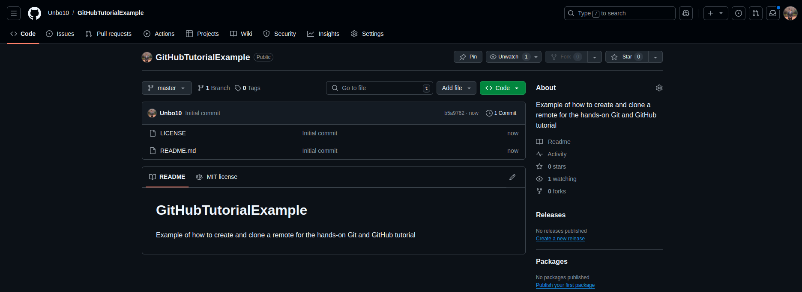

<h1>Git and GitHub Tutorial</h1>

In this document you'll find a tutorial on how to use Git and GitHub.

<h2>Why bother on learning them?</h2>

As a programmer, developer or code enthusiast, at some point, you have changed or will have to change your code and suddenly it doesn't work. You try multiple fixes that should solve the issue you're having, yet nothing works. You're stuck...

Then you remember `Ctrl + Z` or `Cmd + Z` exists, and you try to go back to that one version of your code that was working perfectly fine. However, to your disappointment, it unly undoes so far, and you cannot reach the desired version...

But wait, there is a light at the end of the tunnel: your team members may have saved the correct version of the code you're looking for. You ask them, and they do have it!!! Nonetheless they are using Git and GitHub, that stuff you never bothered to learn for whatever reason.

If you find yourself in this situation or you want to learn how to improve your life, keep reading.

<h2>What is Git?</h2>

Git is a version control system. It keeps track of how a directory evolves in something called a repository (or repo for short), which stores the versions of the directory, metadata and other stuff. In other words, it's like if you had another directory filled with copies of the directory you want to keep track of.

But wait, there is more. There are two distinctive features of Git that make it so appealing:

> - On one hand, it doesn't just copy entire directories every time it records a new version of the directory. Instead, it only saves the changes or deltas made to each file in every version.
> - On the other hand, it has something called branches, which allow you to work on multiple things separetely. 

Let's dive in a bit more on what exactly are branches.

<h3>Branches: Git's cherry</h3>

Suppose you're working on a project whose structure looks like this:

amazing_project/
├── app.py
├── database.db
└── README.md

So far, you've been working on the `app.py` and `README.md` files and they work just fine. However, you now want to play around with the `database.db` file, but you're afraid of breaking it. What do you do?

Well, my friend, you create a branch. A branch is a separate and parallel version of your repo, sort of like a copy of it within itself. In it, you can try new things and experiment without worrying about breaking the main version of your repo. Now, here is the thing: if the version on the branch works, you can merge it back to the main version. If it doesn't, you can just delete the branch and nothing will be affected.

Put in other words, if your directory was your room, each branch would be an exact copy of it that you can modify as you please; you could make it look like fire or set it on fire (don't try this at home), it doesn't matter because your room will remain the same. However, if you do like the changes you made, you can make your room look like the copy you made.

Quite powerful, isn't it? But what if you could share your project with others and work on it together? After all, multiple minds are better than one. Just imagine sharing your room with anyone you want and making it look as you please. That's where GitHub comes in.

<h2>What is GitHub?</h2>

We already saw what Git is, but what is a hub?

> A hub is a place where multiple things come together. It allows multiple things to connect and interact with each other.

Using that and what we know about Git, we can infer that GitHub is a place where multiple Git repositories come together. However, repos do not interact with each other, but the owners, maintainers and contributors of them do.

Overall, it is a website where you can store your repos and share them with others. In addition, it has other software tools that make it easier to publish projects, collaborate with others and manage your work.

<h2>How to use Git</h2>

Now that you know what Git and GitHub are, let's see how to use them.

<h3>Installing Git</h3>

Git isn't installed by default on most operating systems, so you'll have to install it yourself. You can download it from the [official website](https://git-scm.com/).

When you're think you're done, you can type in your therminal the command `git --version` to check if it was installed correctly. It should appear something like `git version 2.34.1`.

<h3>Setting up Git</h3>

Before you start using Git, you need to set up your identity. This is stored in the metadata of your repo, and it's used to identify who made the changes in each version.

To do so, you can use the following commands:

```bash
git config --global user.name "Your username"
git config --global user.email "youremail@something.something"
```

You **do not** need to use your real name or your personal email, just an email you have access to.

<h3>Creating a repository</h3>

Okay, finally we're getting to the fun part. To create a repository, you need to first be in the directory you want to keep track of. Afterwards, you should open a terminal in the directory and type the following command:

```bash
git init
```

The output of this command should be something like this:

```
Initialized empty Git repository in /Path/To/Your/Directory/.git/
```

This means a hidden directory called `/.git` has been created in your repository. This directory is where Git stores all the metadata and versions of your directory.

If you access it (using a command like `cd .git/`), its structure should look like this:

```
.git/
├── branches/
├── config
├── description
├── HEAD
├── hooks/
├── info/
├── objects/
└── refs/
```

You may also see `.` and `..` directories, which are used to navigate directories in Unix-like systems (so ignore them).

You can take a look at the contents in each of the files and directories, but for now, let it be as it is (this is honestly because I am not even sure what some of them do, although it seems something fun to explore).

<h3>Adding files to the repository</h3>

If you already had files in your repository, that's perfectly fine. In this repo, for example, I already had a `README.md` file created. However, if you don't have any, you can try for now to uderstand the basics by just adding a `README.md` file. You can do so by typing the command `touch README.md` in your terminal or by using your system's file explorer.

Now, before 

You may want to type "Hello, world!" or something in your `README.md` file, but just adding it should be enough for git to recognize an untracked file. Don't believe me? You can run the command `git status` in your terminal to see what files are being tracked and what aren't. You should see something like this:

```
On branch main

No commits yet

Untracked files:
  (use "git add <file>..." to include in what will be committed)
        README.md

nothing added to commit but untracked files present (use "git add" to track)
```

Note: If the `README.md` file doesn't appear colored, you can run the command `git --global color.ui auto` to enable colors in your terminal.

The message means you haven't asked Git to track the file yet. To do so, you can use the command `git add README.md`. This won't show any output, but if you run `git status` again, you should see something like this:

```
On branch main

No commits yet

Changes to be committed:
  (use "git rm --cached <file>..." to unstage)
        new file:   README.md
```

> Pro tip: If you want to stage the changes made in all the directories and files in your repository, you can use the command `git add -A`.

This means the file is now being tracked by Git, or, in other words, you have staged the changes to the file (creating it and modifying it if you had written something in it). In fact, you can set the alias `git stage` to `git add` by running the command `git config --global alias.stage add`, if you want to make more clear what you're doing (esentially, they mean the same).

Now, you may be wondering what's with the "On branch main" message. For now, don't worry about it, but just now the branch `main` won't be accessible until you make your first commit, which is what we are going to do next.

<h3>Committing changes</h3>

Committing changes means saving to the repo the changes staged. If you only stage your deltas or changes, Git won't make a new version of the directory until you commit them. To do this, you can use the command `git commit -m "Your message here"`. The `-m` flag is used to add a message to the commit, which is used to describe what changes were made in that version of the directory. You can add as many messages as you want, but usually two `-m` flags suffice to give a title of the changes and a brief description of them.

Note: if you're curious, you can modify the file and run the command `git status` to see what happens. You might notice the file is staged as both staged and not staged. This is because from the moment you staged the file to now, there has been a delta or change in the file that hasn't been staged yet. This means you could commit a previous version of a file unintentionally, so be careful (if that's the case, you can stage the file again).

For example, you can run the command `git commit -m "Add README.md" -m "Add a README.md file to the repository"` (to write it in imperative is the standard) to commit the changes made to the `README.md` file. The output should be something like this:

```
[main (root-commit) aaaa123] Add README.md
 1 file changed, 169 insertions(+)
 create mode 100644 README.md
```

This means the changes were successfully committed to the repo. If you run the command `git status` again, you should see something like this:

```
On branch main
nothing to commit, working tree clean
```

So there are no changes staged; all have been committed. Now, let's walk a bit through the output of the commit command:

- `main (root-commit) aaaa123`: `main` is the branch you are in (yes, you are in a branch!). In fact, `main` became available to you after you made your first commit (you can now run the `git branch` command and you should see `* main`). `root-commit` means this is the first commit in the repository. `aaaa123` is the commit hash, which is a unique identifier for the commit. You can use it to refer to the commit in the future.
- `1 file changed, 169 insertions(+)`: This means one file was changed and 169 lines were added to it. The `+` means lines were added, but you could also see a `-` if lines were removed.
- `create mode 100644 README.md`: `create mode` means the file was created, and `100644` is the mode with which it was created (it is associated to the permissions of the file, but you don't need to worry about it).

Now, take a pause and congratulate yourself, you have successfully created a repository, added a file to it and committed the changes made to the file. You are now a Git user!!!

After your deserved break, let's try the the cherries mentioned before: branches.

<h3>Creating a branch</h3>

Well, you don't really need to create a branch, Git has already done that. Don't believe me? Run the command `git branch` and it should appear `* main` in green, meaning this is the branch you are in.

Now, let's create a **new** branch. But before that, let's define something like a principle when it comes to create branches: you should only and always create a branch when you're going to, a) work on a new feature, b) fix a bug or c) experiment with something. Apart from the `main` branch or the main branch of your repos, all of the other branches are supposed to be merged into the `main` branch at some point; they are temporary. 

Think about it: if you are redesigning your room, you surely can let your and your team's imagination run wild, but at the end, your room is only one, the rest are copies, and should be eliminated if they are not going to become your room.

On the note, branches' names are supposed to briefly describe best what you're doing on that branch. Also, you will use `-` to separate words in the name of the branch.

That said, you are prepared to create a branch to work on a new feature. Say you want to add your name and a brief description of yourself to the `README.md` file (this is quite a cliché but works just fine. However, feel free to do whatever with your `README.md` file, just make sure to name the branch and the commit accordingly). 

To do that, you should first run `git status` to make sure there are no uncommitted changes in the repo. In case there are and those correspond to the feature you're implementing, you can commit them or stash them.

> Stashing changes means saving all the changes (both unstaged and staged) in a temporary place. You can stash multiple changes and apply them later. However, for the purpose of what we're doing (create a branch and work on a new feature), you can run the command `git stash` to stash all the changes made in the `main` branch. This will allow you to create the branch. After you are in the branch, you can use the command `git stash pop` to apply the changes you stashed in the feature branch.

Now (finally!!!), you can create a branch using the command `git branch feature/add-name-description`. Now, if you run the command `git branch`, you should see something like this:

```
  * main
  feature/add-name-description
```

Note: The convention to name branches is by first declaring what the branch is about, or its category (e.g., `feature`, `bugfix`, `experiment`, etc.), and then what the branch is going to do (starting with a verb in imperative).

However, you are still in the `main` branch: if you run `git status`, the first line should read `On branch main`. To switch to `feature/add-name-description`, you can use the command `git switch feature/add-name-description`. If you run `git status` again, you should see `On branch feature/add-name-description`, and if you run `git branch`, you should see `* feature/add-name-description`, now on green (whereas `main` isn't).

Note: The command `git checkout` is a more powerful version of `git switch` (and maybe a more widely used). However, Git introduced `git switch` and `git restore` to separate the two uses of `git checkout` (switching branches and restoring files). If you're curious, you can read more about [here](https://stackoverflow.com/questions/57265785/whats-the-difference-between-git-switch-and-git-checkout-branch).

Now, you can modify the `README.md` file to add your name and a brief description of yourself. After you've done that, you can stage the changes and commit them. You can use the commands `git add README.md` and `git commit -m "Add name and description to README.md" -m "Add my name and a brief description of myself to the README.md file"` to do so. 

Afterwards, you may run `git status` and there shouldn't be any changes to commit. But, let's look at something more interesting. Run the command `git log`, and you will see something like this:

```
commit aaaa123 (HEAD -> feature/add-name-description)
Author: Your username <your email>
Date:   Mon Nov 1 00:00:00 2021 -0300

    Add name and description to README.md

    Add my name and a brief description of myself to the README.md file

commit bbbb456 (main) 
Author: Your username <your email>
Date:   Sun Oct 31 00:00:00 2021 -0300

    Add README.md

    Add a README.md file to the repository
```

Note: The commit hash will certainly be much longer that the ones shown above.

This means you have two commits in the `feature/add-name-description` branch and one commit in the `main` branch. The `HEAD` pointer is pointing to the `feature/add-name-description` branch, which means you are in that branch. Now, you may want to exit the history of commits by pressing `q`, and you will be back in a new command line of the terminal.

Once you've done that, you should switch to the `main` branch to learn a concept that brings all the cherries right into your main dish.

<h3>Merging branches</h3>

Merging branches means combining the changes made in one branch with the changes made in another branch. This means the branch you're merging has already solved its purpose, i.e., you have already added a feature, fixed a bug or experimented with something, and you want to make the changes available in the branch you're merging into.

Following our example from earlier, let's merge the `feature/add-name-description` branch into the `main` branch. To do so, you should first switch to the `main` branch using the command `git switch main`. Now, you can use the command `git merge feature/add-name-description` to merge the `feature/add-name-description` branch into the `main` branch. If anything goes to plan, you should see something like this:

```
Updating aaaa123..bbbb456
Fast-forward
 README.md | 12 +
 1 file changed, 12 insertion(+) 1 deletion(-)
```

The number of deletions and insertions may vary depending on the changes made in the branch you're merging. Also, the first line means the commit history of the `main` branch was updated to include the commit history of the `feature/add-name-description` branch, in this case, only one commit beginning in `bbbb456`.

If you run the command `git log`, you should see something like this:

```
commit bbbb456 (HEAD -> main, feature/add-name-description)
Author: Your username <your email>
Date:   Mon Nov 1 00:00:00 2021 -0300

    Add name and description to README.md

    Add my name and a brief description of myself to the README.md file
```

Of course, other commits may appear, but you can now see the commit made in the `feature/add-name-description` branch is now in the `main` branch. In consequence, as mentioned earlier, the `feature/add-name-description` branch is no longer needed and can be deleted. You can do so by using the command `git branch -d feature/add-name-description`.

Congratulations, you have successfully merged a branch into another branch. You are now a Git novice!!!

<h2>How to use GitHub</h2>

Now that you have your first repo, you want to share it with others or simply store it online to access it from another device any time. You could just upload the files to your favorite cloud storage service and share that link, but what if you start working on separate versions on different devices? Or what if others start working on different files?

Rewinding a bit to the analogy, you like to have copies of your room to modify it and improve it, but what if you were working on a mall? You would probably need a hand if you want to make it look best, but you also want that teamwork to be efficient: you wouldn't like to download the entire repo over and over again and figuring out which parts have been changed. That's where GitHub comes in.

<h3 id="create1">Creating an online repo from an existing one</h3>

Using the repo we had been working on in this tutorial, let's create an online repo on GitHub.

Assuming you already have already created an account, you can go to the [GitHub website](https://github.com/dashboard). Once you're there, you can click on the `📕 New` button in the top left (right below the navigation or settings bar). At the top and center, you will see something like this:


The owner of course won't be my GitHub profile, but yours. The name of the repo can be anything you want, but it is recommended to name it the same as the directory you're keeping track of. You may skip adding it a description, but bear in mind it is a good practice to add it as soon as possible (doesn't have to be long).

Finally, you have two choices regarding the visibility of your online repo: 
- Public: Anyone can see the repo and its contents, and fork it (which means to copy it to their own account).
- Private: Only you and the people you invite can see the repo and its contents, and fork it.

The following section is what you should be seeing after you set up the basic settings. However, *do not* add a README file, a license or a .gitignore file yet (you will do this when creating the repo from scratch in GitHub). This won't allow you to upload our repo that easily. You may add them in a future commit.


Now, you may click on `Create repository`, and voilà, you have created an online repo on GitHub. You should see something like this:


Instead of "GitHubTutorial", the name you gave to your repo should appear, and instead of `master` you should see `main` or the name of your default branch.

Once you have checked that, you may want to look at the bottom instructions on how to push an existing repository. Let's go through them!

1. `git remote add origin https://github.com/YourUsername/YourRepo.git` (replacing `YourUsername` and `YourRepo` with your GitHub username and the name of the repo, respectively).
  
    Here, you are using the `git remote` command, which deals with the interaction between your repo and remote or online repos. Using `add origin` you are adding a remote called `origin` to your repo. `origin` is just a convention. Finally, the URL is the adress of the online repo you just created (finished in *.git* though).

2. **Ignore** `git branch -M main`. This command is used to rename the branch you're in, but you don't need to do that (you should confirm you are in the `main` branch though).

3. `git push -u origin main`.

    The `git push` command is widely used to upload the changes made to one of the branches of your repo to one of the branches of a remote repo. The `-u` flag is used to set the upstream branch for your current branch (`main` in this case). 
    
    Consequently, from the `main` branch, if you run `git push`, Git will know you want to push the changes to the `main` branch of the remote repo, and similarly, if you run `git pull`, Git will know you want to pull the changes from the `main` branch of the remote repo to the `main` branch of your repo (only if that's your current branch).

You should see something similar to this after you run the last command:

```
Enumerating objects: 3, done.
Counting objects: 100% (3/3), done.
Delta compression using up to 8 threads
Compressing objects: 100% (2/2), done.
Writing objects: 100% (3/3), 3.86 KiB | 3.86 MiB/s, done.
Total 3 (delta 0), reused 0 (delta 0), pack-reused 0
To https://github.com/Unbo10/GitHubTutorial.git
 * [new branch]      main -> main
Branch 'main' set up to track remote branch 'main' from 'origin'.
```

Notice the last line confirms us the upstream branch was set up correctly. You may want to visit your repo on GitHub to see the changes you made. You should see the `README.md` file you created and the commit message you wrote.


Congratulations, now you can use both Git and GitHub decently well!!!

If you want to try something else to learn about the `git pull` command and the `.gitignore` files, you can look at the following section.

<h3>Creating a repo from GitHub and cloning it</h3>

Let's go back to the beginning of the [last section](#create1). Go to the dashboard or home page of your GitHub account and click on the `📕 New` button and set up the name, description and visibility of your new repo. Afterwards, let's have a look at the extra settings:


Check the box to add a `README.md` file and choose an MIT license. I would guide you on creating the `.gitignore` file later. Now, click on `Create repository`. You should see something like what's on the following screenshot (bearing in mind the names of your repo and your default branch may differ from mine):



As you can see, GitHub set a header with your repo's name and added the description below it. In addition, it included the template of an MIT license in the file `LICENSE` with your name on it. Pretty cool, right?

Now, you may be wondering how to work on it if it's a remote repo? Well, allow me to introduce you to `git clone`. This command is used to download a remote repo to your local machine. It is followed by the URL of the repo you want to clone. You can find it by clicking on the green `<> Code` button and copying the URL that appears there (selecting the HTTPS protocol).

Afterwards, you should open a terminal with the path of the directory you've been working on throughout this tutorial. Once you have one, you can run the command

```
git clone https://github.com/YourUsername/YourNewRepo.git
```

with the URL being the one you copied from the `<> Code` button. You should see something like this:

```
Cloning into 'YourRepoName'...
remote: Enumerating objects: 4, done.
remote: Counting objects: 100% (4/4), done.
remote: Compressing objects: 100% (4/4), done.
remote: Total 4 (delta 0), reused 0 (delta 0), pack-reused 0 (from 0)
Receiving objects: 100% (4/4), done.
```

And in an automatically-created `YourRepoName` folder, you should see the `README.md` and `License` file you created in GitHub. You can now open the folder and start working on the repo as you would with any other repo.

<h3>Creating a `.gitignore` file</h3>

Notice that with the last example or case, your last repo is inside another one. Now, this is not actually a problem, in fact, to organize your local files and directories, you will often do this. However, you should ignore the repo you just cloned from GitHub, as you don't want to track the changes made to it in your main repo (the one with your name and description).

To do so, in your main repo, you should create a `.gitignore` file. This file is used to tell Git to ignore certain files or directories when tracking changes (so any changes to them won't appear unstaged or staged). 

You can ignore an specific file or directory, or all the files with a certain extension. For example, if you want to ignore all the files with the `.txt` extension, you can add `*.txt` to the `.gitignore` file. For the purpose of what you did, you can write `YourRepoName/` in the `.gitignore` file to ignore the repo you cloned from GitHub. 

That way, if you run the `git status` command, you shouldn't see the `YourRepoName/` directory as untracked or staged, but you will see a new untracked file called `.gitignore`.

<h2> Useful commands</h2>

- `git status`: Shows the status of the repository, including what files are staged, not staged and untracked.
- `git add <file>`: Stages the changes made to a file. Using the `-A` flag stages all the changes made in the repository.
- `git restore --staged <file>`: Unstages the changes made to a file. You can only unstage one change at a time.
- `git commit -m "Your message here"`: Commits the changes made to the files staged. You can use the `-m` flag to add a message to the commit.
- `git log`: Shows the commit history of the repository. You can use the `--oneline` flag to show a more concise version of the commit history.
- `git branch`: Shows the branches in the repository. The branch with the `*` is the branch you are in.
- `git branch <branch-name>`: Creates a new branch. You can use the `-d` flag to delete a branch.
- `git stash`: Stashes the changes made in the repository. You can combine it with `pop` to apply the changes stashed.
- `git remote add origin <URL>`: Adds a remote to the repository. You can use the `-v` flag to see the remotes added.
- `git push -u origin <branch>`: Pushes the changes made in the branch to the remote.
- `git clone <URL>`: Clones the remote repository to the local machine.
- `git pull`: Pulls the changes made in the remote to the repository.


